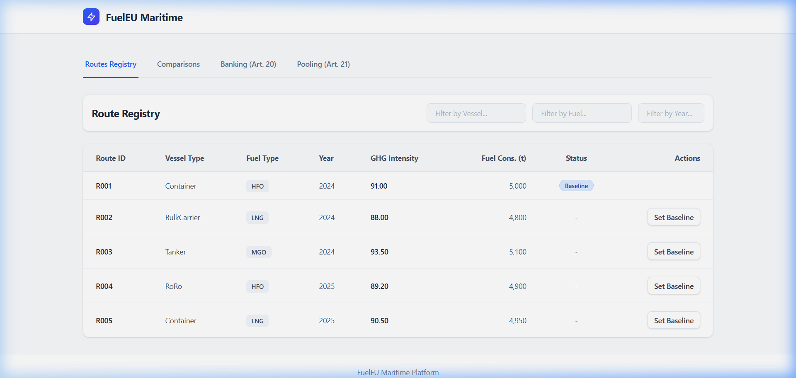
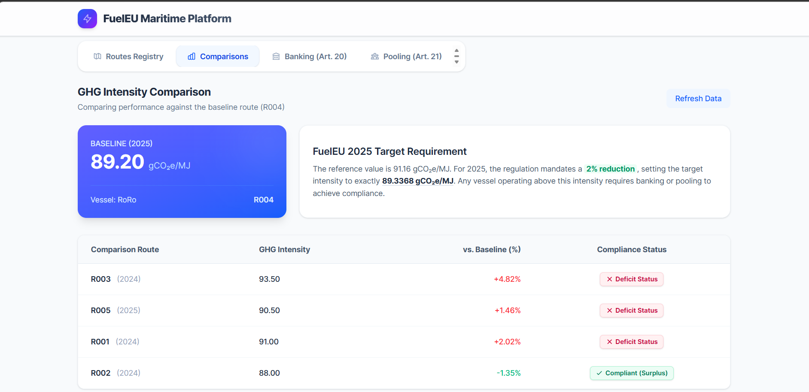
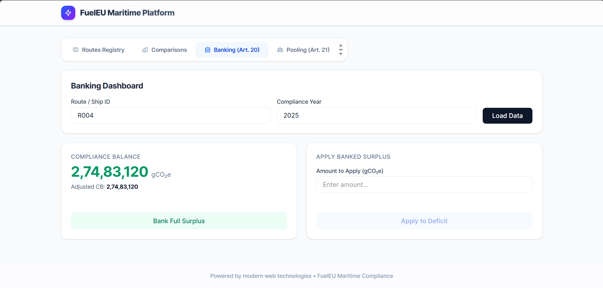
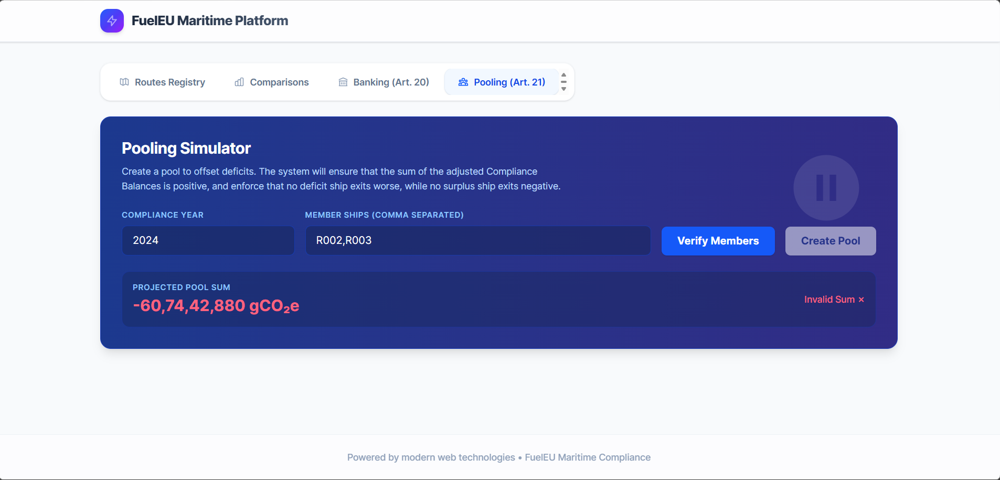

<div align="center">
  
  
  <h1>🚢 FuelEU Maritime Compliance Platform</h1>
  
  <p><strong>A modular, full-stack implementation of the FuelEU Maritime Regulation (EU)</strong></p>

  <p>
    
    
    
    
    
  </p>
</div>

---

A full-stack implementation of the FuelEU Maritime regulation modules focusing on Route Management, Emission Comparisons, Banking (Article 20), and Pooling (Article 21).

Built with a focus on strict **Domain-Driven Design** and **Hexagonal Architecture**, utilizing an AI agent exclusively as a specialized assistant for targeted UI micro-interactions and complex FuelEU formula verification.

## 📑 Table of Contents
- [Architecture Summary](#-architecture-summary)
- [Setup & Run Instructions](#-setup--run-instructions)
- [Testing](#-testing)
- [Sample Requests](#-sample-requests--responses)
- [Platform Demonstration](#-platform-demonstration)

---

## 🏛 Architecture Summary

This platform abandons traditional MVC structures in favor of a strict **Hexagonal Architecture (Ports & Adapters)** pattern. This ensures that the core regulatory business logic (FuelEU formulas) remains 100% framework-agnostic, decoupled from databases, HTTP routers, or UI frameworks.

### Backend Structure
By isolating the mathematical domain, we guarantee that the complex FuelEU compliance formulas are protected from infrastructure changes.

1. **`core/domain` (Entities & Value Objects):** 
   - Contains pure TypeScript representations of `Ship`, `ComplianceBalance`, and `Pool`.
   - Embeds mathematically strictly typed formulas for calculating *Target GHG Intensities* and *Compliance Balances* (e.g., specific `41,000 MJ/t` energy mapping). 
   - Zero dependencies on external libraries.
   
2. **`core/ports` (Interfaces):**
   - **Inbound Ports**: Interfaces (e.g., `IBankingUseCases`) defining operations the UI is permitted to trigger.
   - **Outbound Ports**: Interfaces (e.g., `IRouteRepository`) demanding specific data contracts.

3. **`core/application` (Services):**
   - Implements the mapped Inbound Ports. Example: `PoolingService.ts` handles the granular orchestration of pool verifications.

4. **`adapters/inbound` & `adapters/outbound`**:
   - Contains the Express.js HTTP Controllers and the explicit Prisma logic (`PrismaRouteRepository.ts`). Translates domain contracts into live PostgreSQL queries.

### Frontend Structure
The frontend cleanly mirrors the backend's architecture, structurally separating UI rendering from React effect lifecycles and HTTP boundaries.

1. **`core/domain`**: Unified TypeScript interfaces strictly validating the backend DTOs.
2. **`core/application`**: Custom asynchronous React Hooks (`useBankingTab.ts`, `usePoolingTab.ts`) resolving complex context bounds.
3. **`adapters/infrastructure`**: Raw Axios clients executing pure network calls.
4. **`adapters/ui`**: React layout components styled with TailwindCSS, deeply testable and 100% decoupled from the network layer.

---

## 🚀 Setup & Run Instructions

**Prerequisites**: Node.js v20+

### Database Configuration
Update the `DATABASE_URL` in `backend/.env` with your PostgreSQL instance (e.g., Neon Postgres).

### Starting the Backend
```bash
cd backend
npm install
npx prisma db push
npx prisma db seed      # Executes the nested tsx seed script 
npm run dev
```
> The backend API runs cleanly on `http://localhost:3001`.

### Starting the Frontend
```bash
cd frontend
npm install
npm run dev
```
> The frontend UI spins up on `http://localhost:5173` (or the nearest available Vite port).

---

## 🧪 Testing

The core Hexagonal domain logic is strictly type-checked (`strict: true`) and heavily tested using Jest (`backend`). The UI component adapters are asserted using Vitest and React Testing Library (`frontend`).

```bash
# Backend (Supertest integrations & Jest unit logic)
cd backend && npm test

# Frontend (Vitest JSDOM components)
cd frontend && npm test
```

---

## 📡 Sample Requests & Responses

<details>
<summary><b>Get Compliance Balance (Adjusted)</b></summary>

```bash
curl -X GET "http://localhost:3001/compliance/adjusted-cb?shipId=R001&year=2024"
```

*Response:*
```json
{
  "shipId": "R001",
  "year": 2024,
  "adjustedCB": -12502100
}
```
</details>

<details>
<summary><b>Create a Compliance Pool (POST)</b></summary>

```bash
curl -X POST "http://localhost:3001/pools" \
     -H "Content-Type: application/json" \
     -d '{"year":2024,"members":["R001","R002"]}'
```

*Response:*
```json
{
  "success": true,
  "pool": {
    "id": "e421cd9-33aa-45cc...",
    "year": 2024,
    "members": [
      { "shipId": "R001", "cbBefore": -12502100, "cbAfter": 0 },
      { "shipId": "R002", "cbBefore": 25000000, "cbAfter": 12497900 }
    ]
  }
}
```
</details>

---

## 📺 Platform Demonstration

Below are high-resolution screenshots of the live platform utilizing its optimized **Glassmorphism UI** across the four primary regulation stages:

### 1️⃣ Routes Registry
Vessel filtering across all seeded routes with status tracking.


### 2️⃣ GHG Intensity Comparisons
Visual bar-chart scaling of actual GHG intensities against the rigid 2025 Target Requirement (89.34 gCO₂e/MJ).


### 3️⃣ Banking Dashboard (Art. 20)
Live isolation of Compliance Balances (e.g. R001 computing a deficit of -340,956,000 gCO₂e).


### 4️⃣ Pooling Simulator (Art. 21)
Real-time pool projecting evaluating mathematical constraint validation (ensuring deficits don't sink surplus vessels into negatives).

